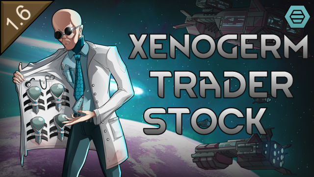

# Xenogerm Trader Stock

## About

In vanilla RimWorld with Biotech, the only way to get a specific xenotype is to collect individual genes and assemble a xenogerm yourself — a slow and expensive process. Xenogerms exist as items but traders never sell pre-made ones for preset xenotypes.

This mod adds complete xenogerms to trader inventories, letting you purchase a ready-made xenotype package instead of hunting down each gene individually.

## Features

### Xenogerm Trading

- **Preset xenogerms at traders**: Exotic goods traders stock xenogerms for preset xenotypes, modded xenotypes detected automatically
- **Proper xenotype assignment**: Purchased xenogerms assign xenotype identity on implantation, enabling ideology recognition
- **Ideology-aware implantation**: An ideoligion with a preferred xenotype accepts a xenogerm for that xenotype instead of vanilla's blanket "Ideoligion forbids" refusal (bloodfeeder refusals still apply)
- **Naturalized germline members**: Enable endogene-only xenotypes in mod settings to create naturalized germ-line members
- **Player-scenario xenotypes**: The custom xenotypes your starting colonists were created with are stocked too
- **Configurable spawn weighting**: Price-driven commonality — expensive xenogerms are rarer by default, or choose a different scaling

### Pricing

Xenogerm prices are based on gene complexity, metabolism impact, and archite gene count, e.g:

- Pigskin, Impid, Dirtmole: 1,500-1,700 silver
- Hussar, Starjack, Highmate: 1,700-2,000 silver
- Sanguophage: ~3,600 silver

### Mod Settings

- **Xenotypes for sale** — A grid of every sellable xenotype, preset or player-scenario, with its shelf price. Tick what traders may stock; the Archite, Germline and Player-scenario rows switch whole groups at once. Germline xenotypes (Impid, Yttakin, Baseliner) start unsold since implanting one converts the pawn outright; everything else starts sold.
- **Xenogerm pricing** — Sliders for the base preset value and the per-metabolism, per-complexity and per-archite-gene multipliers
- **Stock quantity** — Per-trader-kind range for how many xenogerms a visit carries
- **Implantation** — *Implant germline xenotypes as endogenes* writes a germline xenogerm's genes into the pawn's germline, so children inherit them and later implants stack instead of overwriting (default: on). *Preserve deathrest capacity through implantation* keeps serum-bought deathrest capacity through any xenogerm implant or reimplant, which vanilla resets to one (default: on)
- **Xenotype commonality by price** — How price weights spawn chance: inverse, inverse root (default), linear, square root, bell curve or uniform

## Requirements

- **RimWorld 1.6** or later
- **Biotech DLC** (required)

## Installation

### Steam Workshop (Recommended)

Subscribe on the [Steam Workshop](https://steamcommunity.com/sharedfiles/filedetails/?id=3794698080) and it will auto-download.

### Manual Installation

1. Download the latest release from the [Releases](https://github.com/sam-hunt/XenogermTraderStock/releases) page
2. Extract the `XenogermTraderStock` folder to your RimWorld `Mods` directory:
   - **Windows**: `C:\Program Files (x86)\Steam\steamapps\common\RimWorld\Mods\`
   - **Mac**: `~/Library/Application Support/Steam/steamapps/common/RimWorld/RimWorldMac.app/Mods/`
   - **Linux**: `~/.steam/steam/steamapps/common/RimWorld/Mods/`
3. Enable the mod in RimWorld's mod menu
4. Restart RimWorld

## Compatibility

- **Gene Trader mod** (`tac.genetrader`) — Fully supported. If installed, the orbital gene trader will also stock xenogerms.
- **Save-safe** — Can be added or removed mid-game without issues.
- **Xenotype mods** — Automatically includes xenotypes from other mods.
- **Vanilla Races Expanded - Android** — Android xenotypes are never sold (they are machines, not genelines) and stay out of the settings grid. Other mods can opt their own non-organic genes out the same way by adding `<li Class="XenogermTraderStock.GeneExtension"><excludeFromXenogermStock>true</excludeFromXenogermStock></li>` to a gene's `<modExtensions>`.

## Contributing

Bug reports and feature requests welcome on [GitHub Issues](https://github.com/sam-hunt/XenogermTraderStock/issues).
Please attach any relevant logs/stack traces/mod lists etc.

For development setup, see [CLAUDE.md](CLAUDE.md).

## Credits

**Author**: Sam Hunt ([@sam-hunt](https://github.com/sam-hunt))

**Built With**:

- [Harmony](https://github.com/pardeike/Harmony) by Andreas Pardeike — Runtime patching library

**Special Thanks**:

- [Ludeon Studios](https://ludeon.com) for RimWorld and modding API
- [The RimWorld modding community](https://steamcommunity.com/app/294100/workshop/) for inspiration and working examples
- Hero art by [IcingWithCheeseCake](https://steamcommunity.com/profiles/76561198094174176/myworkshopfiles/?appid=294100)
